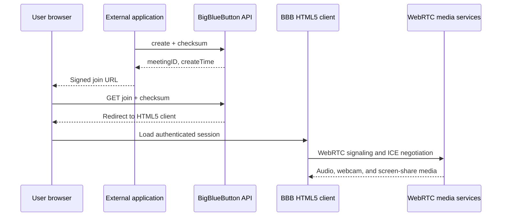

This guide explains how an external application can create a BigBlueButton meeting and launch a user into WebRTC audio, webcam, and screen sharing.

## Support status

BigBlueButton supports WebRTC for external integrations **through the BigBlueButton HTML5 client**. The supported integration contract is the checksummed HTTP API: an application server creates a meeting, generates a signed `join` URL, and sends the user's browser to that URL. The HTML5 client then performs WebRTC signaling and media negotiation.

BigBlueButton does **not** currently expose a stable public API for a third-party WebRTC client to publish or subscribe to raw media directly. In particular, the HTML5 client's GraphQL connection, `/bbb-webrtc-sfu` WebSocket protocol, LiveKit credentials, and session-authenticated endpoints such as `stuns` are internal interfaces. They can change between BigBlueButton releases without a compatibility or deprecation period.

| Integration requirement | Status | Recommended approach |
| --- | --- | --- |
| Create, join, monitor, and end a meeting from another application | Supported | Use the checksummed [BigBlueButton API](/development/api) from the application server |
| Use microphone, webcam, and screen sharing | Supported | Launch the user into the BigBlueButton HTML5 client with a signed `join` URL |
| Show BigBlueButton inside another web application | Deployment-dependent | Load the signed `join` URL in an iframe and satisfy the browser and proxy requirements below |
| Build a completely custom media UI with `RTCPeerConnection` or a LiveKit SDK | No stable public API | Use the BigBlueButton HTML5 client, maintain a version-coupled custom client, or use a media platform that provides a public SDK |
| Obtain an ICE server list and connect directly to the SFU | Not sufficient or supported | The internal `stuns` endpoint does not provide the signaling contract or authorize an external media client |

## Supported architecture



The API secret is used only between the external application's backend and BigBlueButton. It must never be sent to frontend JavaScript, a mobile application, or an untrusted client.

## Prerequisites

Before integrating, verify the following:

- BigBlueButton is available through a public HTTPS hostname with a certificate trusted by the user's browser. Browser media capture requires a secure context.
- The external application's backend can reach `https://bbb.example.com/bigbluebutton/api`.
- TCP port 443, WebSocket proxying, the configured media UDP range, and NAT addresses are correct. See [Configure the firewall](/administration/firewall-configuration).
- A [TURN server](/administration/turn-server) is available when users may be behind networks that block direct UDP media.
- The API URL and shared secret have been read on the BigBlueButton server with `sudo bbb-conf --secret` and stored in a server-side secret store.

## Integration flow

### 1. Sign API requests on the application server

For each API call, serialize the query parameters first. Compute the checksum over the exact string:

```text
callName + serializedQueryString + sharedSecret
```

The serialized query string used in the request must be byte-for-byte identical to the string used for the checksum, including parameter order and percent encoding. BigBlueButton supports multiple checksum algorithms; SHA-256 is a suitable default when it is enabled on the server.

The following Node.js module demonstrates signing, creating a meeting, and generating a join URL. It uses `fast-xml-parser` only to parse the XML API response.

```bash
npm install fast-xml-parser
```

```js
import { createHash } from 'node:crypto';
import { XMLParser } from 'fast-xml-parser';

const apiBase = requireEnv('BBB_API_BASE').replace(/\/+$/, '');
const sharedSecret = requireEnv('BBB_SECRET');
const xmlParser = new XMLParser();

function requireEnv(name) {
  const value = process.env[name];
  if (!value) throw new Error(`Missing environment variable: ${name}`);
  return value;
}

function signedUrl(callName, parameters) {
  const query = new URLSearchParams();

  for (const [name, value] of Object.entries(parameters)) {
    if (value !== undefined && value !== null) {
      query.append(name, String(value));
    }
  }

  const serializedQuery = query.toString();
  const checksum = createHash('sha256')
    .update(`${callName}${serializedQuery}${sharedSecret}`, 'utf8')
    .digest('hex');

  return `${apiBase}/${callName}?${serializedQuery}&checksum=${checksum}`;
}

async function callApi(callName, parameters) {
  const response = await fetch(signedUrl(callName, parameters));
  const body = await response.text();
  const result = xmlParser.parse(body)?.response;

  if (!response.ok || result?.returncode !== 'SUCCESS') {
    throw new Error(
      `BigBlueButton ${callName} failed: ${result?.messageKey ?? response.status} ${result?.message ?? ''}`,
    );
  }

  return result;
}

export async function createMeeting({ meetingID, name }) {
  return callApi('create', {
    meetingID,
    name,
    record: false,
    // Use URLs on your own application so users return to the expected page.
    logoutURL: 'https://app.example.com/meetings',
  });
}

export function buildJoinUrl({ meetingID, createTime, user }) {
  // fullName, userID, and role must come from the authenticated application
  // session. Do not accept a requested MODERATOR role directly from the browser.
  return signedUrl('join', {
    meetingID,
    createTime,
    fullName: user.displayName,
    userID: user.id,
    role: user.canModerate ? 'MODERATOR' : 'VIEWER',
    logoutURL: 'https://app.example.com/meetings',
  });
}
```

Configure it with values similar to:

```text
BBB_API_BASE=https://bbb.example.com/bigbluebutton/api
BBB_SECRET=replace-with-the-output-from-bbb-conf
```

Do not expose either environment variable to browser code. For more details, see the [API security model](/development/api#api-security-model).

### 2. Create the meeting

Call `create` before issuing join URLs. The operation is idempotent for a running meeting with the same `meetingID`.

```js
const meeting = await createMeeting({
  meetingID: 'course-42-session-7',
  name: 'Course 42',
});
```

Keep the returned `createTime` with the meeting. Supplying it on `join` prevents an old join URL from being accepted by a later meeting that reuses the same `meetingID`.

Do not set `cameraBridge`, `screenShareBridge`, or `audioBridge` unless the selected bridge is installed and configured on the BigBlueButton server. The defaults are the correct choice for most integrations.

### 3. Generate one join URL per authenticated user

Generate the role and stable `userID` from the external application's authenticated user and authorization rules.

```js
const joinUrl = buildJoinUrl({
  meetingID: 'course-42-session-7',
  createTime: meeting.createTime,
  user: {
    id: 'user-1842',
    displayName: 'Ada Lovelace',
    canModerate: false,
  },
});
```

Return this URL only to that authenticated user. Treat it as a short-lived bearer-style launch URL: do not put it in analytics events, support logs, or pages visible to other users.

Optional per-user parameters can ask the HTML5 client to begin the audio or webcam flow:

```js
const joinUrl = signedUrl('join', {
  meetingID: 'course-42-session-7',
  createTime: meeting.createTime,
  fullName: 'Ada Lovelace',
  userID: 'user-1842',
  role: 'VIEWER',
  'userdata-bbb_auto_join_audio': true,
  'userdata-bbb_auto_share_webcam': true,
});
```

These parameters cannot bypass browser permission prompts, autoplay restrictions, or the need for a user gesture. An application must not assume that the microphone or camera is active until the BigBlueButton client reports it to the user.

### 4. Navigate the browser to the signed join URL

The recommended launch is a top-level navigation:

```js
window.location.assign(joinUrlFromYourBackend);
```

The browser must request the signed `/join` URL itself. This lets BigBlueButton establish the browser's HTTP session and redirect it to the authenticated HTML5 client.

Avoid calling `join?redirect=false` from the application backend and then copying the returned HTML5 client URL into another browser. The session token is tied to the HTTP session established by the join request, so the other browser will normally be missing the required `JSESSIONID` cookie.

After the HTML5 client loads, the user chooses microphone, listen-only audio, webcam, or screen sharing. The client owns device selection, browser permissions, signaling, ICE, reconnection, and media state.

### 5. Monitor and finish the meeting

Use stable integration endpoints such as `isMeetingRunning`, `getMeetingInfo`, and `end`. Use [webhooks](/development/webhooks) or the documented callback parameters when the external application needs asynchronous meeting lifecycle events.

## Embedding in an iframe

A top-level redirect is the most reliable option. An iframe is possible only when the browser, the BigBlueButton reverse proxy, and the embedding application's security policies all permit it.

Set the iframe `src` to the signed `/join` URL, not to a client URL obtained by a server-side `redirect=false` request:

```html
<iframe
  src="SIGNED_JOIN_URL_FROM_YOUR_BACKEND"
  allow="camera; microphone; display-capture; autoplay; fullscreen"
  allowfullscreen
></iframe>
```

Check all of the following in the target browsers:

- The embedding page and BigBlueButton page both use HTTPS.
- `Permissions-Policy` and the iframe `allow` attribute permit camera, microphone, screen capture, autoplay, and fullscreen as required.
- `Content-Security-Policy: frame-ancestors` and `X-Frame-Options` do not reject the embedding origin.
- Cross-site cookie rules allow the BigBlueButton session cookie. Same-site deployment is more reliable; cross-site deployment may require a `SameSite=None; Secure` cookie policy and is still subject to browser privacy controls.
- The iframe has enough space for device prompts, media controls, and screen-share dialogs.

The meeting parameter `allowRequestsWithoutSession=true` relaxes the `JSESSIONID` check and may help a trusted iframe integration, but it reduces session security. Prefer a normal browser-established session. Enable this parameter only after a threat review and only for meetings that require it.

## Why direct WebRTC access is not an external API

The public BigBlueButton API manages meetings and users; it does not return an SDP offer, an SFU access token, or a stable media endpoint. A successful direct media connection also requires BigBlueButton-specific signaling, authorization, meeting state, user permissions, stream metadata, and lifecycle events.

The following interfaces are used by the bundled HTML5 client and must not be treated as public integration contracts:

- `/bbb-webrtc-sfu` signaling messages
- GraphQL HTTP and WebSocket operations used by the client
- LiveKit room names, participant identities, and access tokens
- `sessionToken`-authenticated endpoints, including `stuns` and `getJoinUrl`
- Internal Redis or event-bus messages

The `stuns` response only describes ICE servers and candidates. It neither authenticates a third-party media client nor defines how that client publishes or subscribes to a BigBlueButton stream.

If a custom media UI is mandatory, the choices are to maintain a client that is explicitly coupled to a particular BigBlueButton release, or to use a WebRTC service with a supported client SDK and integrate it separately. This is substantially different from consuming the stable BigBlueButton HTTP API.

## Multi-tenant external services

BigBlueButton has one API shared secret per server; it does not issue a separate native credential for each tenant. Use a tenant-aware gateway when multiple external services need isolated credentials, namespaces, policies, and quotas.

The `bbb-tenant-gateway` service in this source tree provides this boundary. A tenant such as `lunar-one` receives a gateway API key and calls an endpoint such as:

```text
https://rtc.example.com/v1/tenants/lunar-one
```

The gateway authenticates the tenant, changes an external meeting ID such as `course-42` to the internal ID `lunar-one:course-42`, enforces the tenant policy, and signs the upstream BigBlueButton request with the server-wide shared secret. The tenant never receives that upstream secret.

Use the gateway for tenant-specific API authentication, origins, moderator and recording permissions, participant limits, concurrent-meeting limits, rate limits, and supported media bridge selection. Strict media-plane isolation requires routing the tenant to a dedicated BigBlueButton server or pool; choosing a bridge type on `create` does not create a tenant-specific SFU endpoint.

See `bbb-tenant-gateway/README.md` in the source tree for configuration and request examples.

## Production checklist

- Keep the shared secret in a backend secret store and rotate it if it is exposed.
- Authenticate users before generating join URLs and derive `MODERATOR` access on the server.
- Use a unique, unguessable meeting ID and a stable external user ID.
- Include `createTime` in join requests when meeting IDs can be reused.
- Rate-limit meeting creation and join-URL endpoints in the external application.
- Do not log full signed URLs, checksums, session tokens, or API secrets.
- Verify camera, microphone, listen-only audio, and screen sharing on every supported browser.
- Test from both an unrestricted network and a restrictive network that requires TURN.
- Test reconnects, duplicate tabs, leaving, meeting end, and return URLs.
- Re-run the integration tests when upgrading BigBlueButton, especially if any internal client interface has been customized.

## Troubleshooting

| Symptom | Likely cause | Check |
| --- | --- | --- |
| `checksumError` | Query encoding or order changed after signing | Sign and send the exact same serialized query string |
| Join works in a top-level tab but not in an iframe | Cookie, frame, or permission policy | `SameSite`, `frame-ancestors`, `X-Frame-Options`, `Permissions-Policy`, and iframe `allow` |
| Client loads but microphone or webcam cannot start | Browser permission, HTTPS, WebSocket, NAT, UDP, or TURN issue | Browser console, device permission, [firewall configuration](/administration/firewall-configuration), and TURN |
| A client URL returned by `redirect=false` reports an invalid session | Join was performed in a different HTTP session | Let the user's browser navigate to the signed `/join` URL |
| Direct SFU connection fails after using `stuns` | ICE configuration is only one part of the internal media flow | Use the BigBlueButton HTML5 client; there is no stable direct-media API |
